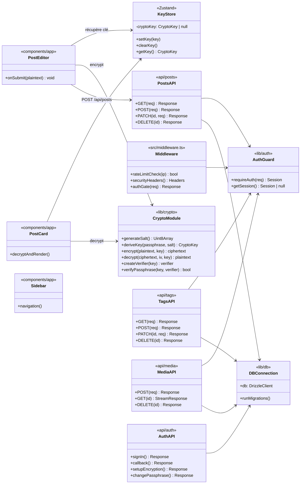

# Diagramme de classes / composants, NullPost

## Découpage par responsabilité

- **`lib/crypto/`** : cryptographie pure (sans dépendance UI ni DB).
- **`lib/auth/`** : gestion de session (utilisé partout).
- **`lib/db/`** : connexion + schéma + migrations.
- **`app/api/`** : endpoints REST (validation + DB).
- **`components/app/`** : composants applicatifs (utilisent crypto + appellent l'API).
- **`components/ui/`** : composants visuels purs (sans logique métier).

## Inversion de dépendance

- Les composants UI ne connaissent pas la base de données : ils passent par l'API.
- L'API ne connaît pas la cryptographie : elle stocke et renvoie du ciphertext.
- La cryptographie ne connaît pas la base : elle travaille sur des `string` / `Uint8Array`.

Cette séparation rend chaque couche **testable indépendamment** :
- `crypto.test.ts` teste la cryptographie sans serveur.
- `db/integration.test.ts` teste la DB sans navigateur.
- `e2e/*.spec.ts` teste l'ensemble sans mocks.
