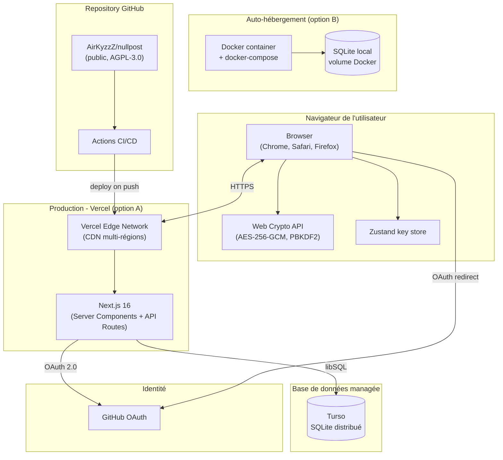

# Diagramme de déploiement, NullPost



## Cibles supportées

| Cible | Configuration | Notes |
|---|---|---|
| **Vercel** (production actuelle) | `vercel.json`, déploiement auto sur push `main` | Edge Network global, scaling auto |
| **Netlify** | `netlify.toml`, plugin `@netlify/plugin-nextjs` | Alternative testée |
| **Docker self-host** | `Dockerfile` + `docker-compose.yml` | SQLite local, parfait pour usage privé |
| **Manuel** | `npm run build && npm start` | Pour développement / VPS |

## Variables d'environnement

| Variable | Obligatoire | Description |
|---|---|---|
| `DATABASE_URL` | Non | URL libSQL (défaut : `file:./data/nullpost.db`) |
| `DATABASE_AUTH_TOKEN` | Pour Turso | Token d'authentification Turso |
| `AUTH_SECRET` | **Oui** | Secret JWT Auth.js (générer avec `openssl rand -base64 32`) |
| `AUTH_GITHUB_ID` | **Oui** | Client ID GitHub OAuth App |
| `AUTH_GITHUB_SECRET` | **Oui** | Client Secret GitHub OAuth App |
| `ALLOWED_GITHUB_USER` | Non (recommandé) | Restreint l'accès à un identifiant GitHub |

## Pipeline de déploiement

```
Push vers main
    │
    ▼
GitHub Actions (CI)
    ├── ESLint
    ├── Vitest (unitaires + intégration)
    ├── Build Next.js
    └── Playwright E2E
    │
    ▼ (si CI verte)
Vercel build
    ├── npm ci
    ├── next build
    └── Génération des fonctions Edge
    │
    ▼
Déploiement Production
    └── nullpost.maximemansiet.fr
```

## Reproductibilité

- **`Dockerfile`** : image minimale (multi-stage, build production).
- **`docker-compose.yml`** : volume persistant pour les données.
- **`drizzle/`** : migrations SQL versionnées, rejouables sur n'importe quelle base SQLite.
- **`package-lock.json`** : versions exactes des dépendances.

## Sauvegardes

- **Turso** : sauvegardes managées toutes les 24 h, restauration point-in-time.
- **Self-host** : copie périodique du fichier SQLite (`cron` ou outil équivalent).
- **Tests de restauration** : remplacer le fichier ou restaurer le point Turso, redémarrer
  le serveur, vérifier que l'application fonctionne. Validé manuellement avant chaque
  release majeure.
