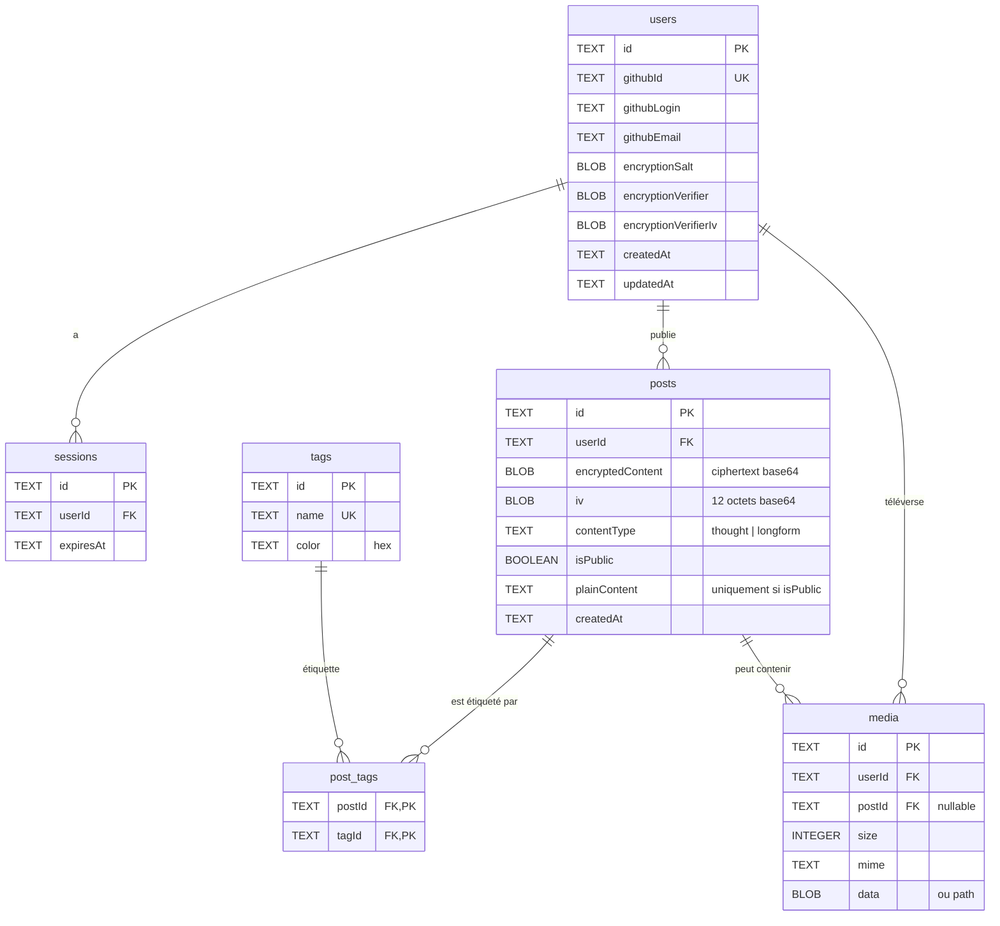

# Modèle conceptuel de données — NullPost



## Cardinalités

| Relation | Cardinalité | Notes |
|---|---|---|
| `users` ↔ `sessions` | 1 — N | Plusieurs sessions actives possibles |
| `users` ↔ `posts` | 1 — N | Un utilisateur publie plusieurs posts |
| `users` ↔ `media` | 1 — N | Médias téléversés par l'utilisateur |
| `posts` ↔ `post_tags` | 1 — N | Table de liaison |
| `tags` ↔ `post_tags` | 1 — N | Table de liaison |
| **`posts` ↔ `tags` (transitif)** | **N — N** | Many-to-many via `post_tags` |
| `posts` ↔ `media` | 1 — N | Un post peut contenir plusieurs médias ; un média peut être orphelin (`postId = null`) |

## Suppression en cascade

- Supprimer un `user` → supprime ses `sessions`, `posts`, `media`.
- Supprimer un `post` → supprime les lignes `post_tags` correspondantes ; les `media`
  associés deviennent orphelins (`postId` devient `null`) plutôt que supprimés, pour
  permettre une récupération.
- Supprimer un `tag` → supprime les lignes `post_tags` ; les `posts` restent.

## Données chiffrées vs en clair

| Champ | Chiffré ? | Pourquoi |
|---|---|---|
| `posts.encryptedContent` | **Oui** (AES-256-GCM) | Cœur de la promesse de confidentialité |
| `posts.iv` | Non (mais aléatoire) | Doit être stocké en clair pour pouvoir déchiffrer |
| `posts.contentType` | Non | Métadonnée non sensible (thought ou longform) |
| `posts.isPublic` | Non | Doit être lisible côté serveur pour exposer le post public |
| `posts.plainContent` | Non | **Uniquement si `isPublic = true`** (publication volontaire) |
| `tags.name` / `tags.color` | Non | Étiquettes de classement (non sensibles dans ce projet) |
| `media.size` / `media.mime` | Non | Métadonnées techniques |
| `media` (contenu binaire) | **Oui** | Chiffré client-side avant upload |
| `users.encryptionSalt` | Non | Doit être en clair pour redériver la clé au login |
| `users.encryptionVerifier` | Oui | Texte connu chiffré, sert à valider la passphrase |

## Évolutions du schéma

Toutes les évolutions de schéma passent par Drizzle Kit :

```bash
# Modifier src/lib/db/schema.ts puis :
npx drizzle-kit generate     # produit un fichier SQL versionné
npx drizzle-kit push          # applique sur la base
```

Les fichiers SQL générés sont commités dans `drizzle/` et appliqués automatiquement au
boot du serveur (sauf en serverless où l'on pousse manuellement avant déploiement).

## Migration majeure récente

L'ajout de `posts.isPublic` + `posts.plainContent` pour la fonctionnalité de **profils
publics** a nécessité :
1. Génération d'une migration `0003_add_public_posts.sql`.
2. Mise à jour des types TypeScript.
3. Ajout d'un test E2E pour `/profile/[username]`.
4. Documentation dans `README.md` (section Phase 1 features).

Cet épisode est traçable dans l'historique git et témoigne de la **maintenance évolutive**.
