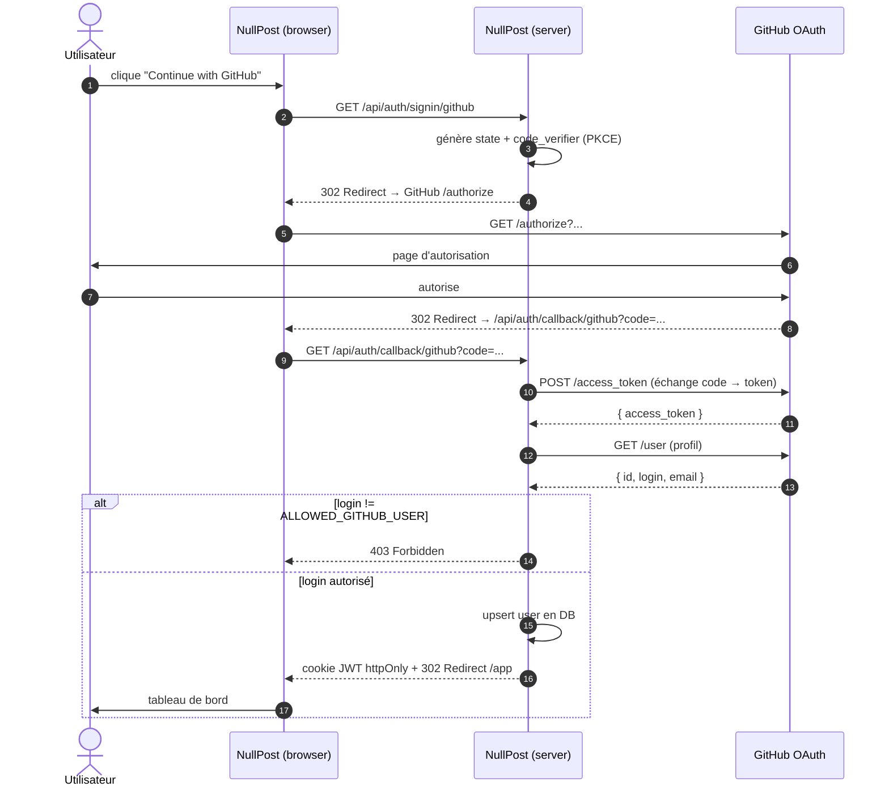
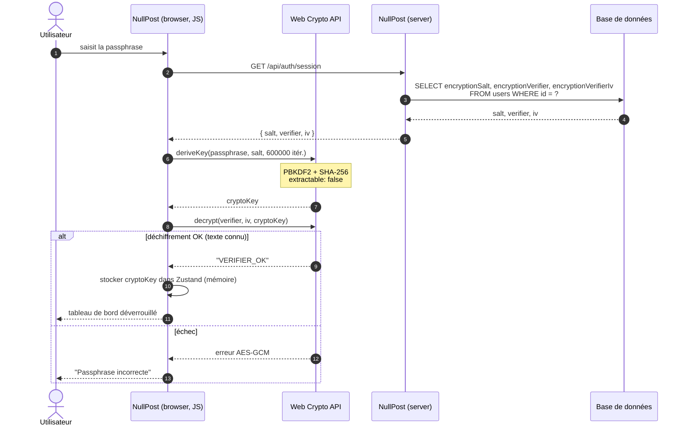

# Diagramme de séquence, Authentification + déverrouillage chiffrement

## Phase 1, OAuth 2.0 GitHub

## Phase 2, Déverrouillage du chiffrement

## Notes de sécurité

- **Étape 13 (clé non extractible)** : `extractable: false` empêche l'export via JavaScript.
  Seules les fonctions `encrypt` / `decrypt` natives de Web Crypto peuvent l'utiliser.
- **Étape 16 (vérificateur)** : on chiffre un texte connu (« VERIFIER_OK ») au moment du
  setup. Au login, on tente de le déchiffrer ; si on retrouve le texte d'origine, la
  passphrase est correcte.
- **Aucun mot de passe en base** : l'authentification HTTP est entièrement déléguée à
  GitHub. La passphrase ne quitte jamais le navigateur.
- **Cookie JWT httpOnly + SameSite** : non-accessible en JavaScript, immune au XSS et CSRF.
