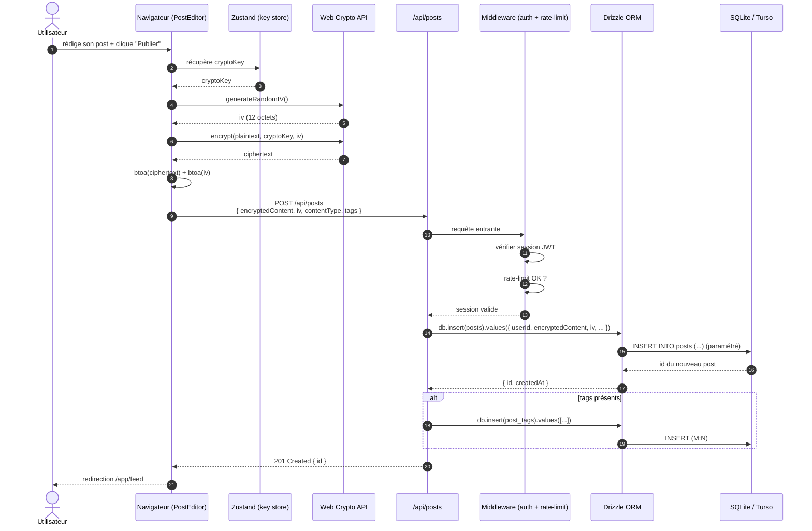
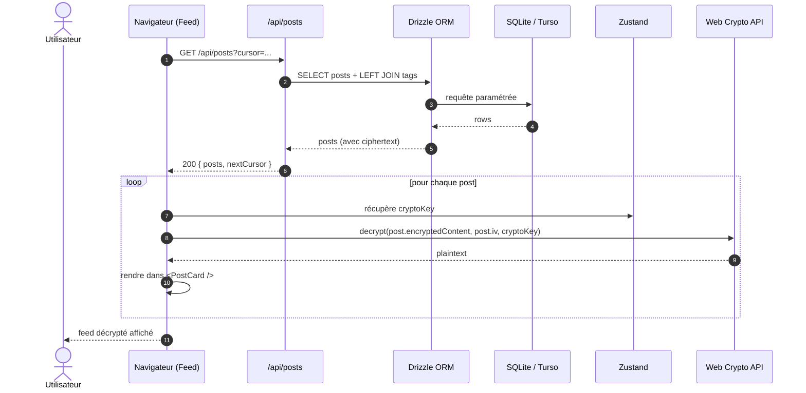

# Diagramme de séquence — Création et lecture d'un post chiffré

## Création d'un post

## Lecture du feed

## Notes

- **Étape 4 (génération IV)** : un IV unique de 12 octets est généré pour CHAQUE post.
  Réutiliser un IV avec la même clé en mode GCM compromettrait la confidentialité — d'où
  l'unicité stricte vérifiée par les tests (`crypto.test.ts`).
- **Étape 14-17** : Drizzle ORM produit du SQL paramétré, pas de risque d'injection.
- **Étape 11 (rate-limit)** : 100 req/min/IP. Au-delà, 429 + en-tête `Retry-After`.
- **Étapes 26-28** : le déchiffrement se fait **côté navigateur**, jamais sur le serveur.
- **Pagination par curseur** : `nextCursor` permet de charger les pages suivantes sans
  duplication ni saut.
