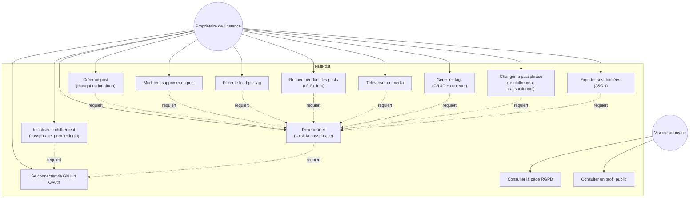

# Diagramme de cas d'utilisation — NullPost

## Acteurs

- **Propriétaire de l'instance** : un seul utilisateur authentifié via GitHub OAuth ;
  identifié par `ALLOWED_GITHUB_USER`. Toutes les actions de création / modification
  passent par lui.
- **Visiteur anonyme** : peut consulter la landing page, la page RGPD et les profils publics
  (si l'utilisateur les a activés et a publié des posts publics).

## Cas d'utilisation prioritaires

1. **UC4 — Créer un post** : flux principal, illustre le chiffrement client-side AES-256-GCM.
2. **UC10 — Changer la passphrase** : illustre la maintenance évolutive avec re-chiffrement
   transactionnel de tous les posts existants.
3. **UC13 — Consulter un profil public** : seule fonctionnalité accessible sans
   authentification, illustre la séparation contenu privé / public.
